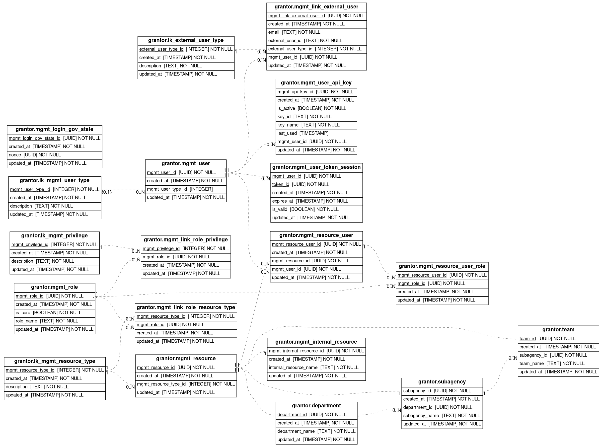

# Overview
This folder contains ERD diagrams representing the `grantor` schema used by the grants-management-api.

Diagrams can be manually generated by running `make create-erds` from the `api` folder.

# Dependencies
As this requires additional dependencies on `graphviz`, the `make create-erds` command runs in a slightly modified
docker image than our usual API. This just includes a few additional dependencies for making the images.

# Caveats
The diagrams generated are based on our SQLAlchemy models metadata, and not the database itself, which can cause a few differences:

* Property fields are SQLAlchemy only and generally represent relationships (ie. values fetched via a foreign key `join`)

# Files

## Grantor Schema
