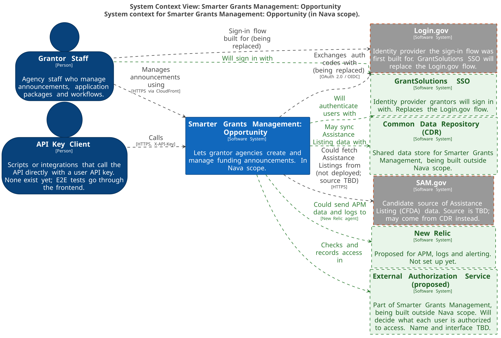
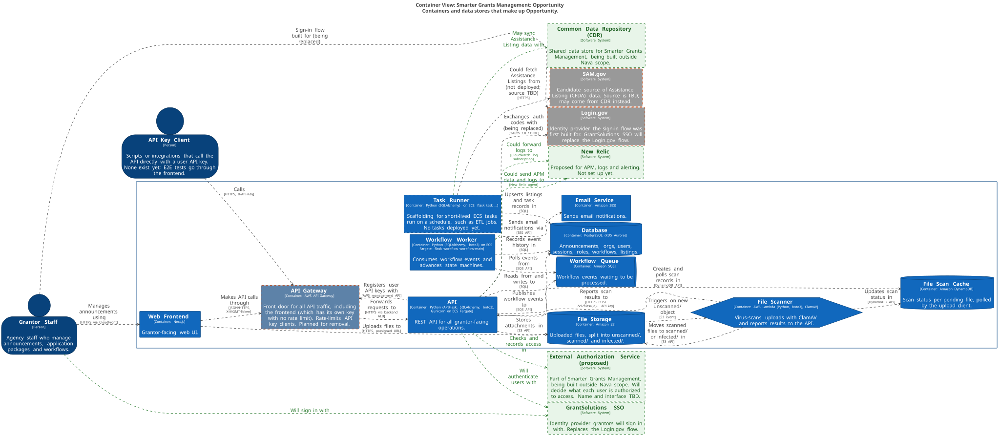
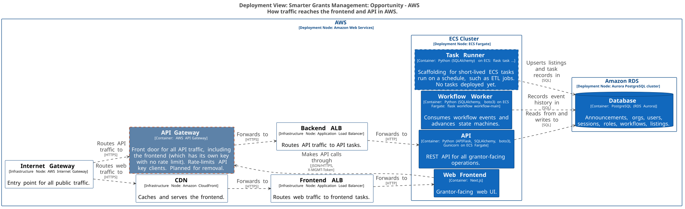
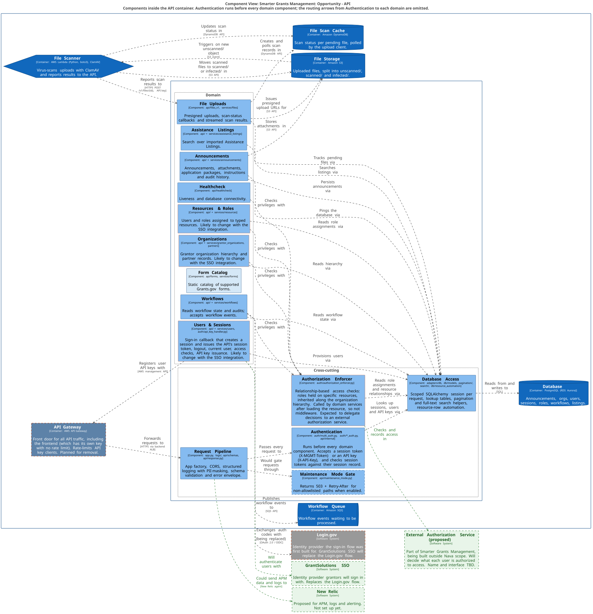
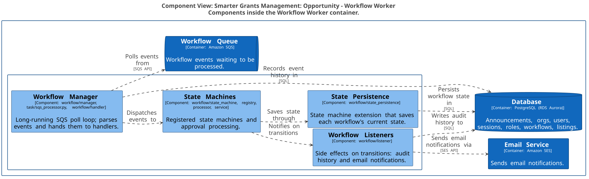
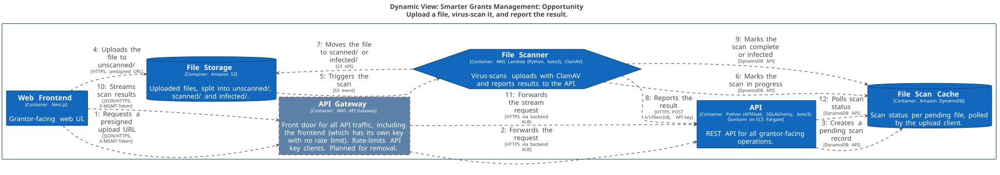
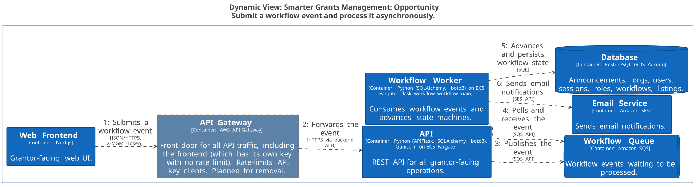
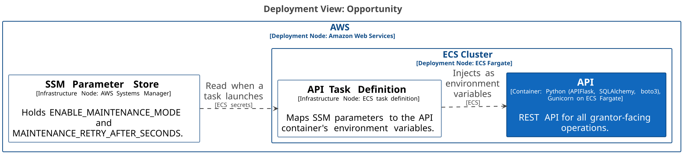

# Smarter Grants Management: Opportunity Architecture

> **Status: in development.** This document covers Opportunity, the part of Smarter Grants Management in Nava scope. Opportunity is not in production and has no users yet. The diagrams show what has been built so far. New components, such as new API blueprints, will be added as development continues.

This document describes Opportunity end to end using the [C4 model](https://c4model.com). It starts with the system as a whole and zooms in: system context, containers, deployment, components, then key runtime flows.

The diagrams are generated from a single model in [`architecture.dsl`](architecture.dsl) (Structurizr DSL). To change a diagram, edit the model and regenerate it; see [CONTRIBUTING.md](CONTRIBUTING.md).

## Contents

1. [Reading the diagrams](#1-reading-the-diagrams)
2. [Planned changes](#2-planned-changes)
3. [System context](#3-system-context)
4. [Containers](#4-containers)
5. [Deployment and network path](#5-deployment-and-network-path)
6. [API components](#6-api-components)
7. [Workflow Worker components](#7-workflow-worker-components)
8. [Key flows](#8-key-flows)
9. [Maintenance mode configuration](#9-maintenance-mode-configuration)

## 1. Reading the diagrams

- **Dark blue person shapes** are users. **Gray boxes** are systems outside Opportunity, including other parts of Smarter Grants Management that are outside Nava scope. **Blue boxes** are parts of Opportunity. **Light blue boxes** are components inside a container.
- **Cylinders** are data stores. The **pipe** is a queue. The **hexagon** is a Lambda function.
- **Every arrow** is labeled with what happens and, in brackets, the protocol or API used (for example `SQL` or `S3 API`). Libraries such as SQLAlchemy and boto3 are listed on the containers that use them, not on the arrows.
- **A dashed border** marks something that exists but is not live: the Maintenance Mode Gate (defined but not registered) and the Task Runner (scaffolding).
- **An orange dashed border** marks something built that is being removed, replaced or reconsidered: API Gateway, the Login.gov flow and SAM.gov as the Assistance Listing source.
- **An orange dotted border** marks components likely to be rewritten or dropped once the GrantSolutions SSO integration is designed: Organizations, Resources & Roles, Users & Sessions and the Authorization Enforcer.
- **Green boxes and arrows** mark planned or proposed additions that are not built or not set up yet: GrantSolutions SSO, the external authorization service, the Common Data Repository (CDR) and New Relic.
- Each diagram has a matching legend in `diagrams/svg/<View>-key.svg`.

## 2. Planned changes

The diagrams show the system as built so far, with these changes flagged on them.

### Decided

- **GrantSolutions SSO will replace the Login.gov flow.** The sign-in flow was first built for Login.gov on the expectation that grantors would use it. Grantors will use GrantSolutions SSO instead. The Login.gov code stays in place until the SSO work replaces it. *Affects:* the Authentication and Users & Sessions components, and the grantor sign-in flow.
- **API Gateway is being removed.** It sits in front of all API traffic, including the frontend's, which uses its own API key with no rate limit. It exists to rate-limit API key clients and is no longer needed. Once it is removed, all traffic will reach the API through the backend ALB. *Affects:* the deployment path, and API key issuance in Users & Sessions.

### Under consideration

These are not decided yet. They are flagged on the diagrams where they apply.

- **Assistance Listing source.** Listing data may come from CDR (the Common Data Repository shared across Smarter Grants Management) instead of directly from SAM.gov, for example by running an ETL into our database and syncing with CDR. The SAM.gov import has never been turned on.
- **External authorization service.** Authorization decisions will probably move to a service being built by another Smarter Grants Management team, outside Nava scope. The Authorization Enforcer would then ask that service what a user can access instead of reading roles from our database. See [Access control](#access-control).
- **Auth-related components.** Organizations, Resources & Roles, parts of Users & Sessions and the Authorization Enforcer will probably be rewritten or dropped, depending on how the GrantSolutions SSO integration and the external authorization service work.
- **In-app notifications.** Email through SES may be joined by other channels, such as storing notifications in a table and showing them to users on a dashboard.

## 3. System context

Who will use Smarter Grants Management: Opportunity (in Nava scope), and which outside systems it depends on.

[Open full size](diagrams/svg/Context.svg)

- **Grantor Staff** will use the web frontend. The sign-in flow was first built for Login.gov; **GrantSolutions SSO** will replace it.
- **API Key Clients** are scripts or integrations that call the API directly with a user API key. None exist yet. E2E tests go through the frontend.
- **SAM.gov** is a candidate source of Assistance Listing (CFDA) data. The source is still to be decided, and data may come from CDR instead. An import command exists in the code but has never been turned on.
- **External authorization service** (proposed) is part of Smarter Grants Management, built outside Nava scope. See [Access control](#access-control).
- **Common Data Repository (CDR)** is a shared data store for Smarter Grants Management, built outside Nava scope. Opportunity may sync Assistance Listing data with it.
- **New Relic** is proposed for APM data, logs and alerting. It is not set up yet.

## 4. Containers

The separately running parts of the system and the data stores they use.

[Open full size](diagrams/svg/Containers.svg)

| Container | Technology | Responsibility | Source |
| --- | --- | --- | --- |
| Web Frontend | Next.js on ECS | Grantor-facing UI. Calls the API through API Gateway with its own frontend API key, and uploads files straight to S3 using presigned URLs. | `frontend/` |
| API Gateway | AWS API Gateway | Front door for all API traffic. Rate-limits API key clients with usage plans; the frontend's key has no limit. **Planned for removal.** | `infra/modules/service/api_gateway.tf` |
| API | Python (APIFlask, SQLAlchemy, boto3), Gunicorn on ECS Fargate | REST API for all grantor-facing operations. | `api/src` (`app.py`) |
| Workflow Worker | Python (SQLAlchemy, boto3) on ECS Fargate (`flask workflow workflow-main`) | Long-running service that consumes workflow events from SQS and advances state machines. | `api/src/workflow`, `infra/api/service/workflow.tf` |
| Task Runner | Python (SQLAlchemy) on ECS (`flask task ...`) | **Scaffolding.** Runs short-lived ECS tasks on a schedule, such as ETL jobs. No tasks are deployed yet. | `api/src/task`, `infra/api/app-config/env-config/scheduled_jobs.tf` |
| File Scanner | AWS Lambda (Python, boto3) with ClamAV | Virus-scans each upload, moves it to `scanned/` or `infected/`, and reports the result to the API. | `infra/modules/clamav` |
| Database | PostgreSQL (RDS Aurora) | System of record for announcements, organizations, users, roles, workflows and listings. | `api/src/db` |
| File Storage | Amazon S3 | Uploaded files under `unscanned/`, `scanned/` and `infected/` prefixes. | `infra/api/app-config/env-config/s3_buckets.tf` |
| File Scan Cache | Amazon DynamoDB | Scan status for each pending file, polled while the user waits. | `infra/api/service/file-scan-cache.tf` |
| Workflow Queue | Amazon SQS | Workflow events waiting to be processed. | `infra/api/service/sqs.tf` |
| Email Service | Amazon SES | Sends email notifications, starting with workflow approval emails. Other notification channels are TBD. | `infra/modules/notifications-email-domain` |

The API, Workflow Worker and Task Runner are built from the same image (`api/`) and share the same code. They differ only in the command each one runs.

## 5. Deployment and network path

How traffic reaches the frontend and the API in AWS.

[Open full size](diagrams/svg/Deployment.svg)

| Path | Route |
| --- | --- |
| Web users | Internet Gateway → CloudFront → Frontend ALB → Web Frontend (ECS) |
| Frontend to API | Web Frontend → API Gateway (frontend key, no rate limit) → Backend ALB → API (ECS) |
| API key clients | Internet Gateway → API Gateway (rate-limited) → Backend ALB → API (ECS) |

Once API Gateway is removed, all API traffic will go straight to the backend ALB.

The ECS cluster also runs the Workflow Worker and the Task Runner. Neither takes inbound traffic: the worker polls SQS and the Task Runner runs short-lived tasks. The database is an Aurora PostgreSQL cluster on Amazon RDS.

## 6. API components

The API is organized by domain. Each domain component includes its routes (`api/<domain>`), service code (`services/<domain>`) and SQLAlchemy models. Cross-cutting components are shared by every domain.

In this section and in section 7, all source paths are relative to `api/src`.

[Open full size](diagrams/svg/ApiComponentsClean.svg)

Every request passes through the Request Pipeline and then Authentication before it reaches a domain component (the Healthcheck is the only unauthenticated route). To keep it readable, this view leaves out the routing arrows from Authentication to each domain component. The [full view with every arrow](diagrams/svg/ApiComponents.svg) is also available.

### Cross-cutting components

| Component | Responsibility | Source |
| --- | --- | --- |
| Request Pipeline | Builds the app and registers blueprints. Adds CORS headers, writes structured request logs with PII masking, validates request and response schemas, and returns errors in a standard envelope. | `app.py`, `logs/`, `api/schemas`, `api/response.py` |
| Authentication | Checks who the caller is, before any domain component runs. See [Access control](#access-control). | `auth/multi_auth.py`, `auth/*_auth.py`, `api/internal` |
| Authorization Enforcer | Decides whether a user can act on a specific resource, using relationship-based rules (see [Access control](#access-control)). Domain services call it after they load that resource, such as an announcement, which is why it is not middleware. Expected to delegate its decisions to an external authorization service. | `auth/authorization_enforcer.py` |
| Database Access | Gives each request a scoped SQLAlchemy session. Also holds lookup tables, pagination and full-text search helpers, and ORM hooks that create resource rows automatically. | `adapters/db`, `db/models`, `pagination/`, `search/`, `db/resource_automation` |
| Maintenance Mode Gate | Returns 503 with `Retry-After` for any path not on the allowlist when `ENABLE_MAINTENANCE_MODE` is set. **Defined but not registered in `create_app()`.** | `api/maintenance_mode.py` |

### Access control

Access control has two separate parts.

**Authentication: who you are.** The Authentication component runs before every domain component. It accepts two kinds of credential: a session token (`X-MGMT-Token`) for signed-in users, and an API key (`X-API-Key`) for system-to-system calls. Users sign in through Login.gov, which GrantSolutions SSO will replace. The API handles the Login.gov exchange itself and issues its own session token, which is checked against a session record on every request. API keys are tied to user records, so they work the same way regardless of the identity provider.

**Authorization: what you can do.** The Authorization Enforcer checks each action against the specific resource it targets. This is often called RBAC, but the model is closer to **relationship-based access control (ReBAC)**:

- **Roles are held on resources, not globally.** A user is assigned roles on a specific partner, grantor organization or internal resource. Each role grants a set of privileges.
- **Access follows resource relationships.** A role on a parent organization also applies to the organizations below it. Access to a program comes from roles on its partner, its grant office and program office (and their parent organizations), or any secondary partner.
- **Every check needs the resource first.** The enforcer needs the loaded resource to walk its relationships, so domain services call it once they have fetched that resource.
- **It also answers the reverse question.** It can list which users hold a given privilege on a resource. That list is used, for example, to show a resource's users and to pick approval-email recipients.

No attribute-based rules (ABAC), such as conditions on a resource's status, are part of the enforcer yet. They may be needed as requirements grow.

**Direction.** Authorization decisions will probably come from a service being built by another Smarter Grants Management team, outside Nava scope. The Authorization Enforcer would stay as the single place where domain services ask "can this user do this?". Behind it, it would call the external service instead of reading roles and relationships from our database. The external service would need to support three kinds of request:

- **Check:** "Can this user do X to this resource?"
- **Look up:** "Who can do X to this resource?"
- **Grant:** "User X says that user Y can access this resource." Changes to access would be recorded in the external service, not only read from it.

### Domain components

| Component | Responsibility | Depends on | Source |
| --- | --- | --- | --- |
| Announcements | Announcements, attachments, application packages, instructions and audit history. | Authorization, Database, S3 | `api/announcements`, `services/announcements` |
| Assistance Listings | Search over imported Assistance Listings. | Database | `api/assistance_listings`, `services/assistance_listings` |
| Form Catalog | Static, in-code catalog of supported Grants.gov forms. | None | `api/forms`, `services/forms` |
| File Uploads | Issues presigned uploads, accepts scan-status callbacks from the File Scanner and streams scan results to the client. | Database, S3, DynamoDB | `api/files_v1`, `services/files` |
| Organizations | Grantor organization hierarchy and partner records. Likely to change with the SSO integration. | Authorization, Database | `api/grantor_organizations`, `api/partners`, `services/grantor_organizations`, `services/partners` |
| Resources & Roles | Users and roles assigned to typed resources. Likely to change with the SSO integration. | Authorization, Database | `api/resources`, `services/resources` |
| Users & Sessions | Sign-in callback that issues the API's own JWT, logout, current user, access checks and API key issuance. The sign-in flow will move to GrantSolutions SSO, and this component is likely to change with it. | Database, Login.gov (moving to GrantSolutions SSO), API Gateway (being removed) | `api/users`, `services/users`, `auth/api_key_handler.py` |
| Workflows | Reads workflow state and audits, and publishes incoming workflow events to SQS. | Authorization, Database, SQS | `api/workflows`, `services/workflows` |
| Healthcheck | Liveness and database connectivity for load balancers. | Database | `api/healthcheck` |

A local-only endpoint (`api/local`) for spoofed login is registered only when `ENABLE_LOCAL_ENDPOINTS` is true. `create_app()` raises an error if that flag is set outside a local environment. It is left out of the diagrams.

## 7. Workflow Worker components

[Open full size](diagrams/svg/WorkerComponents.svg)

| Component | Responsibility | Source |
| --- | --- | --- |
| Workflow Manager | Long-running SQS poll loop. Parses each message into a workflow event, records event history and dispatches the event to its handler. | `workflow/manager`, `task/sqs_processor.py`, `workflow/handler` |
| State Machines | Registered state machines and approval processing. | `workflow/state_machine`, `workflow/registry`, `workflow/processor`, `workflow/service` |
| State Persistence | State machine extension that saves each workflow's current state to the database. | `workflow/state_persistence` |
| Workflow Listeners | Side effects of state transitions: writing audit history and sending email notifications through SES (approval emails so far). | `workflow/listener` |

## 8. Key flows

### File upload and virus scan

Files never pass through the API. The browser uploads straight to S3, a Lambda scans the file, and the API learns the result by callback.

[Open full size](diagrams/svg/FileUpload.svg)

1. The frontend asks for a presigned upload URL.
2. API Gateway forwards the request to the API.
3. The API creates a pending scan record in DynamoDB.
4. The frontend uploads the file to `unscanned/` in S3.
5. The S3 upload event triggers the File Scanner Lambda.
6. The scanner marks the scan in progress.
7. The scanner moves the file to `scanned/` if clean or `infected/` if not.
8. The scanner reports the result to the API (`POST /v1/files/{id}`, authenticated with an API key). The API updates the database.
9. The scanner marks the scan complete or infected in DynamoDB. This happens after step 8, so the database is up to date before the client sees a final status.
10. Meanwhile, the frontend streams scan results.
11. API Gateway forwards the stream request to the API.
12. The API polls DynamoDB until the scan reaches a final status or times out.

### Workflow event

Workflow changes are asynchronous. The API only queues the event, and the Workflow Worker processes it.

[Open full size](diagrams/svg/WorkflowEvent.svg)

1. The frontend submits a workflow event.
2. API Gateway forwards it to the API.
3. The API publishes the event to SQS and returns.
4. The Workflow Worker polls SQS and receives the event.
5. The worker advances the state machine and saves the new state to PostgreSQL.
6. Listeners write audit history and send email notifications through SES.

## 9. Maintenance mode configuration

The API never calls SSM at runtime. ECS reads the SSM parameter when a task launches and passes it in as an environment variable. The API reads that value once and caches it with `@cache`. To turn maintenance mode on or off, update SSM and then force a new deployment.

[Open full size](diagrams/svg/MaintenanceConfig.svg)

The gate is not yet active, because `register_maintenance_mode_handler()` is never called from `create_app()`.
