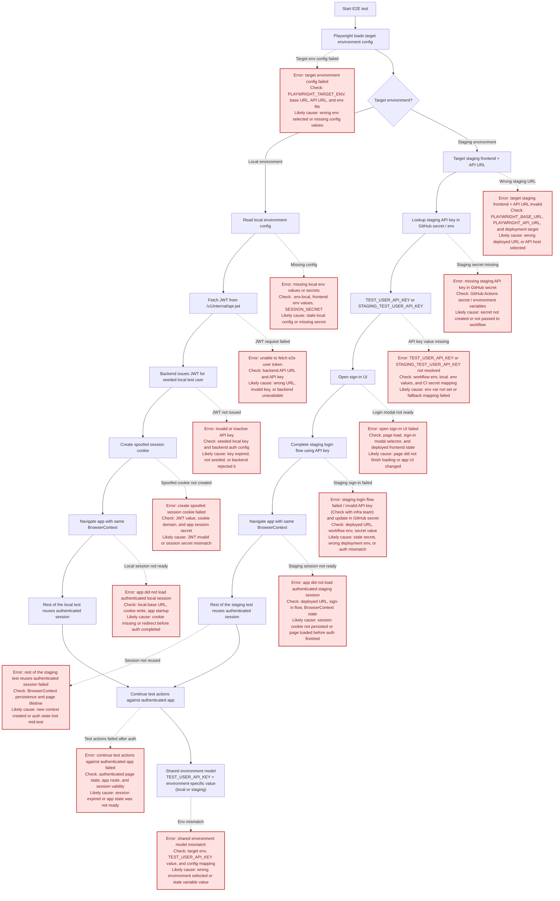

# E2E auth flow: local vs staging

This is a visual guide to the Playwright E2E login flow for local and staging CI runs.


## Mermaid source (saved)



## One quick picture

```text
Spec runs
   |
   v
authenticateE2eUser
   |
   +--> PLAYWRIGHT_TARGET_ENV == "local" ?
   |         |
   |         +--> fetch JWT from /v1/internal/api-jwt
   |                 |
   |                 +--> create spoofed session cookie
   |                         |
   |                         +--> open app
   |
   +--> PLAYWRIGHT_TARGET_ENV == "staging" ?
             |
             +--> open staging frontend
                     |
                     +--> click Sign in
                     |
                     +--> fill API key modal
                     |
                     +--> continue test as signed-in user
```

## Local CI flow

```text
GitHub workflow
   |
   v
CI job sets target = local
   |
   v
Composite action sets:
- PLAYWRIGHT_TARGET_ENV=local
- PLAYWRIGHT_BASE_URL
- PLAYWRIGHT_API_URL
   |
   v
Playwright spec calls authenticateE2eUser
   |
   v
Fetch JWT from /v1/internal/api-jwt
   |
   v
Create spoofed session cookie
   |
   v
Open local app and run test
```

## Staging CI flow

```text
GitHub workflow
   |
   v
CI job sets target = staging
   |
   v
Composite action sets:
- PLAYWRIGHT_TARGET_ENV=staging
- PLAYWRIGHT_BASE_URL
- PLAYWRIGHT_API_URL
   |
   v
Playwright spec calls authenticateE2eUser
   |
   v
Open deployed staging frontend
   |
   v
Click Sign in
   |
   v
Fill API key in modal
   |
   v
Wait for authenticated state
   |
   v
Run test
```

## The decision point

The branching logic lives here:

- [frontend/tests/e2e/utils/auth/authenticate-e2e-user-utils.ts](../tests/e2e/utils/auth/authenticate-e2e-user-utils.ts)

The decision is straightforward:

- if the target is `staging`, use the real frontend API-key modal flow
- otherwise, use the local JWT spoof flow

## Related files

- [frontend/tests/e2e/playwright-env.ts](../tests/e2e/playwright-env.ts)
- [.github/actions/e2e/action.yml](../../.github/actions/e2e/action.yml)
- [.github/workflows/e2e-staging.yml](../../.github/workflows/e2e-staging.yml)
- [.github/workflows/ci-frontend-e2e.yml](../../.github/workflows/ci-frontend-e2e.yml)
